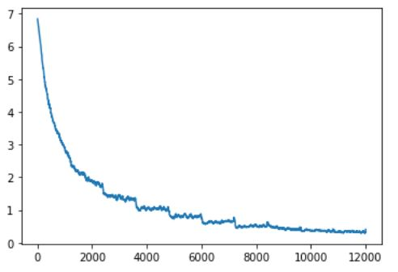
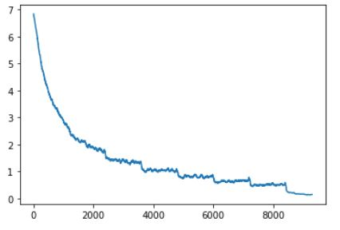
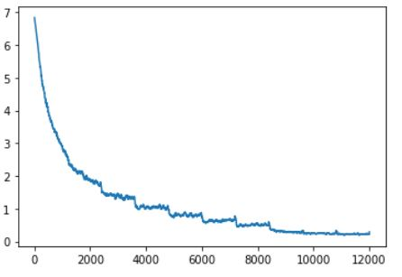

# CSE455 - Final Project

## Problem Description
Bird identification has been a problem plaguing bird watching ethusiasts since the beginning of time. With the myriad of species out in the wilderness it feels near impossible to precisely
verify every bird from memory. With recent advancements in technology the past couple decades this problem will hopefully now be alleviated with the combination of a modern high megapixel camera
and our software. Within our project we explored many different models and settings to find the optimal combination for identifying the birds in an image set.

## Data & Technique Used
We used the Bird Dataset provided by the bird competition from [Kagggle](https://www.kaggle.com/c/birds21sp).

Some of the code is taken from the tutorials shown in class, i.e. importing packages needed and mounting google drive onto the collab notebook. 

Classification model used: [ResNet](https://pytorch.org/hub/pytorch_vision_resnet/), [AlexNet](https://pytorch.org/hub/pytorch_vision_alexnet/), 
[DenseNet](https://pytorch.org/hub/pytorch_vision_densenet/), [SqueezeNet](https://pytorch.org/hub/pytorch_vision_squeezenet/),
[ResNeXt](https://pytorch.org/hub/pytorch_vision_resnext/)

We used four different ResNet models each with varying amounts of convolutional layers (18, 50, 101, and 152 layers). 
ResNeXt is a more efficient and accurate model of ResNet.
AlexNet is expensive to compute, however it was made possible using convolutional neural networks in parallel, thus resulting in high performance. 
DenseNet (Dense Convolutional Network) connect layers together in a feed-forward manner, unlike traditional convolutional networks.
SqueezeNet achieves high accuracy while using 50 times less parameters. 
The difference between SqueezeNet1_0 and SqueezeNet1_1 is that the latter one uses even less parameters and has 2.4 times fewer computations, while still preserving the accuracy.

## Results
Below are graphs of <strong>losses</strong> vs n<strong>um. of image sseen</strong>  for each of the different models.
We ran the predictions of multiple different models and even tried changing the image size and batch size for a few of the models.
#### Resnet18
<strong>Accuracy</strong>: 65.1%

#### Resnet50
<strong>Accuracy</strong>: 56.3%

#### Resnet152
<strong>Accuracy</strong>: 51.5%

From the results, we learned that having more layers for the ResNet model does not mean that it wil perform better.
We can see that there's a decrease in accuracy as we increase the number of layers, from 18 to 50 to 152.

#### Densenet161

#### Alexnet

#### Squeezenet1_0
Shown up until checkpoint 6

#### Squeezenet1_1
Smaller image size, from 128 to 32, this increased loss compared to having image size of 128. Mostly stagnated at 6.9 loss and this is likely to not being able
to gather enough information from such a small crop.

### ResNeXt101

###Experiment 1
We compared 3 different learning rate (0.001, 0.0001, 0.00001) to determine which rate would result in higher accuracy

<strong>Learning Rate: 0.001 </strong> 
<strong>Accuracy</strong>: 72.5%

Smaller batch size, from 128 to 32, this increased the number of images seen during training, from 1400 in the previous 2 models, to 8000 in this model

<strong>Learning Rate: 0.0001 </strong> 
<strong>Accuracy</strong>: 0.2%

<strong>Learning Rate: 0.00001 </strong> 
<strong>Accuracy</strong>: 0.1%

We can see that for this model, decreasing the learning rate decreases the loss rate, but it also decreases the accuracy.
This is because the model overfitted the data during. The accuracy decreased from 72.5% to 0.1%.

###Experiment 2
We compared 3 different decay rates (0.25, 0.001, 0.00005) to determine which rate would result in higher accuracy

<strong>Decay Rate: 0.0005 </strong> 
<strong>Accuracy</strong>: 0.2%

We encountered overfitting as we trained our model for 10 epochs. This is reflected in our accuracy of only 0.2%.

<strong>Decay Rate: 0.001 </strong> 
<strong>Accuracy</strong>: 0.4%

By doubling our decay we received a linear improvement in the accuracy as it doubled to 0.4%.

<strong>Decay Rate: 0.250 </strong> 
<strong>Accuracy</strong>: 0.1%

Hoping to obtain similiar linear improvement we multiplied the decay by 250. If following the same trend it would cause the
accuracy to reach near 100%. This did not pan out as the high decay rate caused our accuracy to worsen to only 0.1%.

## Discussion

### What worked well and didn’t and why?

#### Worked Well:
We were able to configure a model so that it performed 12% better than the baseline results from class.

We also were able to explore different models that better worked for our particular dataset.

We experimented with learning rate and decay which lead us to get a first hand encounter with overfitting and how to combat it.

#### Didn't Work Well:
We constantly ran out of memory in CUDA. To fix this we either configured our settings to use less data, reset our 
cache/network variable, or refreshed our connection and redownloaded all of training/testing data again.

Our gpu limit would be reached and we would have to create a new gmail account to obtain more time.

We would lose connection while running the model and have to restart the process over again.

The disk would get full so couldn't upload the training/test data onto the drive so we had to redownload the data everytime we connnected

We ran into KeyError 749 and 784 when trying to obtain the prediction csv file for a few of the models. 
It wasn’t until the last model we ran that we figured out this error was caused by incorrect sizing in the function 
that creates the prediction csv file. We fixed this by just inputting numbers one lower than the displayed integer in the error
until it no longer  through the error.

We also ran into entry sizing errors while trying to obtain prediction csv file