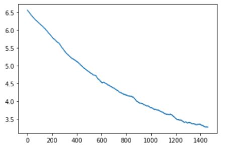
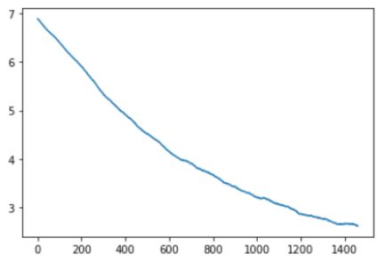
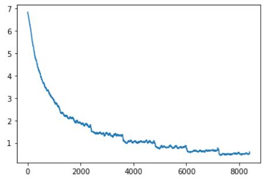
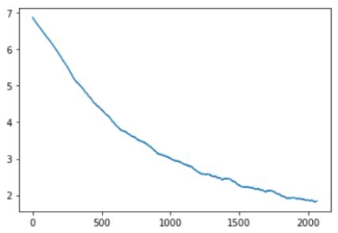
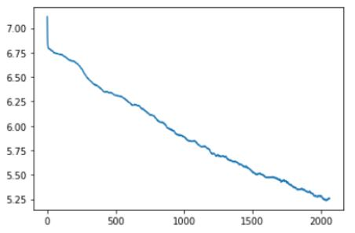
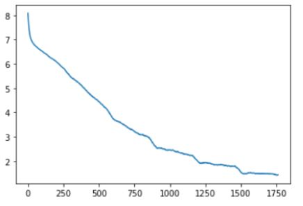
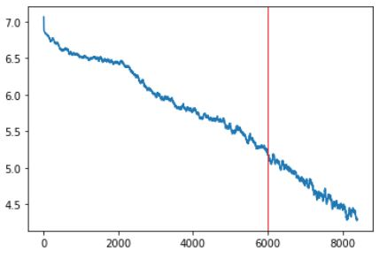

# CSE455 - Final Project

## Problem Description
Bird identification has been a problem plaguing bird watching ethusiasts since the beginning of time. With the myriad of species out in the wilderness it feels near impossible to precisely
verify every bird from memory. With recent advancements in technology the past couple decades this problem will hopefully now be alleviated with the combination of a modern high megapixel camera
and our software. Within our project we explored many different models and settings to find the optimal combination for identifying the birds in an image set.

//Accessible to novices

## Data & Technique Used
We used the Bird Dataset provided by the bird competition from [Kagggle](https://www.kaggle.com/c/birds21sp).

Some of the code is taken from the tutorials shown in class, i.e. importing packages needed and mounting google drive onto the collab notebook. 

Classification model used: [ResNet](https://pytorch.org/hub/pytorch_vision_resnet/), [AlexNet](https://pytorch.org/hub/pytorch_vision_alexnet/), [DenseNet](https://pytorch.org/hub/pytorch_vision_densenet/), [SqueezeNet](https://pytorch.org/hub/pytorch_vision_squeezenet/)

We used four different ResNet models each with varying amounts of convolutional layers (18, 50, 101, and 152 layers).
AlexNet is expensive to compute, however it was made possible using convolutional neural networks in parallel, thus resulting in high performance. 
DenseNet (Dense Convolutional Network) connect layers together in a feed-forward manner, unlike traditional convolutional networks.
SqueezeNet achieves high accuracy while using 50 times less parameters. 
The difference between SqueezeNet1_0 and SqueezeNet1_1 is that the latter one uses even less parameters and has 2.4 times fewer computations, while still preserving the accuracy.
## Results
Below are graphs of losses vs num. of images seen for each of the different models.
We ran the predictions of multiple different models and even tried changing the image size and batch size for a few of the models.
#### Resnet18
Accuracy: 65.1%

#### Resnet50
Accuracy: 56.3%

#### Resnet101
Accuracy: 72.5%

Smaller batch size, from 128 to 32, this increased the number of images seen during training, from 1400 in the previous 2 models, to 8000 in this model

#### Resnet152

#### Alexnet

#### Densenet161

#### Squeezenet1_0
Shown up until checkpoint 6

#### Squeezenet1_1
Smaller image size, from 128 to 32, this increased loss compared to having image size of 128. Mostly stagnated at 6.9 loss and this is likely to not being able
to gather enough information from such a small crop.

